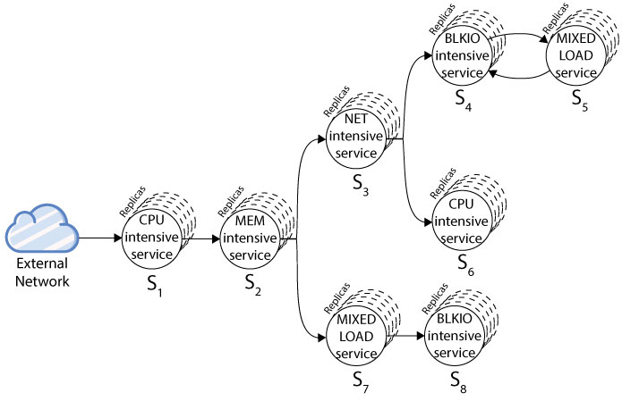

# Introduction to _sfc-stress_: A customizable synthetic service chain (for benchmarking)
**_sfc-stress_** is a customizable, multi-threaded, and Docker/Kubernetes based synthetic chain of services that is used to generate different types of service chaines with various types of workloads. It can be used to emulate any type of service chains in a cluster and can be easily deployed in Kubernetes or Docker Swarm environments. For example, you can generate a service chain like below (this is just an example, you can design your own service chain):    



You can use yaml files inside the `examples` folder to deplot service chain above on the Kubernetes (or use them as an example for your own custom service chain). To start the traffic, you should send a GET request to /s1/cpu/1/1/1. It will then send a single request to s1 and then s1 send the traffic to s2, s2 to s3 and s7 and so on.

# Endpoints:
* */cpu/:workloadSize?/:threadsCount?/:sendToNext?/:payloadSize?/:isPromised? for CPU intensive workloads
* */mem/:dataSize?/:threadsCount?/:sendToNext?/:payloadSize?/:isPromised? for memory intensive workloads
* */blkio/:fileSize?/:threadsCount?/:sendToNext?/:payloadSize?/:isPromised? for disk intensive workloads
* */net/:payloadSize?/:isPromised? for network intensive workloads
* */x/:workloadSize?/:dataSize?/:fileSize?/:payloadSize?/:sendToNext?/:isPromised? for combined workloads


## CPU Intensive Workload: 
Generates <workloadSize> number of Diffie-Hellman keys and calculates their MD5 checksums! It then calls the NetworkIntensiveWorload with zero payload if sendToNext parameter is true.

## Memory Intensive Workload: 
Stores and release <dataSize>MB of data in the memory as a variable! It then calls the NetworkIntensiveWorload with zero payload if sendToNext parameter is true.

## Disk Intensive Workload: 
Writes <fileSize>MB of data in the disk and then deletes it! It then calls the NetworkIntensiveWorload with zero payload if sendToNext parameter is true.

## Network Intensive Workload:
Send <payloadSize>MB of data over network (POST HTTP) to N number of destinations specified in a JSON-based environment variable NEXT_SERVICES_ADDRESSES!
It comes in 2 types:
 
1. **Normal mode:** Send request and exit!
2. **Promised mode:** Send request, wait for the response, and then exit!

To enable promised-mode, pass 1 to isPromised parameter in */net or */x.

Example of `NEXT_SERVICES_ADDRESSES` (also check the examples folder):
```yaml
{
    ".*/s1/cpu/100/1.*": "http://172.16.16.111:30553/s2/mem/1/1/1"
    ".*/s1/mem/2000.*": "http://172.16.16.111:30553/s2/mem/10/1/1,http://172.16.16.111:30553/s3/x/100"
    ".*" : "http://172.16.16.111:30553/s3/cpu/1000/1/1/1"
}
```

## Combined Workload: 
Run all workloads mentioned above once!

# Installation on Kubernetes
Simply use `kubectl apply -f sfc-stress.yaml` and access via `http://<your_nginx_address>/workload/`. Make sure to set NEXT_SERVICES_ADDRESSES environment variable in the yaml file for the network intensive workload and/or for properly forming your service chain graph.

# Evaluations
Make sure you installed following packages on ALL kubernetes nodes:

```
$ sudo apt-get install jq sshpass reptyr linux-tools-common linux-tools-generic linux-tools-`uname -r`
```

Then, in order to enable `perf` syscalls, we should enable `perf_event_open` syscal through `seccomps`. There is a configmap in `examples/seccomp/seccomp-profile.yaml` and corresponding DeamonSet in `examples/seccomp/seccomp-installer.yaml`. Run followings to install both:

```
kubectl apply -f examples/seccomp/seccomp-profile.yaml
kubectl apply -f examples/seccomp/seccomp-installer.yaml
```

And then run s1-s8 yaml files.
[to be continued...]
